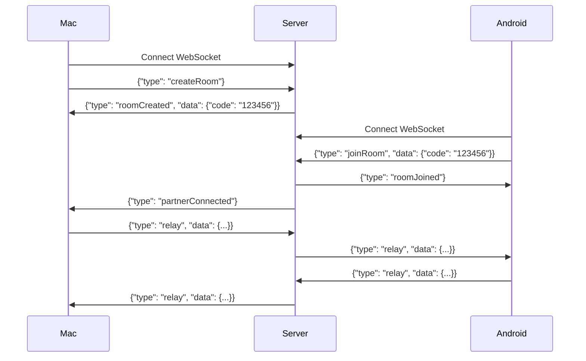

# AirSync WebSocket Relay Server

A production-ready Node.js WebSocket relay server that enables AirSync Mac and Android clients to communicate seamlessly across different networks. The server provides a secure, room-based pairing system with end-to-end encrypted message forwarding.

## 🏗️ Architecture Overview

The AirSync relay server acts as a message forwarding hub between Mac and Android devices:

1. **Mac Client** connects and creates a room, receiving a 6-digit pairing code
2. **Android Client** connects and joins using the pairing code
3. Both devices exchange **encrypted messages** through the relay server
4. The server **never decrypts** messages - it only forwards encrypted data

### Key Features

- 🔐 **End-to-End Encryption**: Server only relays encrypted messages
- 🎯 **Room-Based Pairing**: Simple 6-digit codes for device pairing
- 💓 **Health Monitoring**: Automatic heartbeat/ping-pong for connection health
- 🧹 **Auto Cleanup**: Automatic room cleanup on disconnect or timeout
- 📊 **Connection Management**: Handles multiple simultaneous device pairs
- 🚀 **Production Ready**: Error handling, logging, and graceful shutdown
- ☁️ **Cloud Deployable**: Easy deployment to Heroku, Railway, Render, etc.

## 📋 Requirements

- Node.js 14.0.0 or higher
- npm or yarn package manager

## 🚀 Quick Start

### Installation

```bash
# Clone the repository
git clone https://github.com/abodsakah/airsync-server.git
cd airsync-server

# Install dependencies
npm install
```

### Local Development

```bash
# Start the server (default port 8080)
npm start

# Or with custom port
PORT=3000 npm start
```

The server will be available at:
- WebSocket: `ws://localhost:8080`
- Health check: `http://localhost:8080/health`

### Environment Configuration

Create a `.env` file (optional):

```bash
cp .env.example .env
```

Edit `.env`:
```
PORT=8080
NODE_ENV=development
```

## 🌐 Deployment

### Heroku

[](https://heroku.com/deploy)

**Manual Deployment:**

```bash
# Login to Heroku
heroku login

# Create a new app
heroku create your-airsync-server

# Deploy
git push heroku main

# Check logs
heroku logs --tail
```

**Configuration:**
```bash
heroku config:set NODE_ENV=production
```

**Connection URL:** `wss://your-airsync-server.herokuapp.com`

### Railway

1. Go to [Railway.app](https://railway.app/)
2. Click "New Project" → "Deploy from GitHub repo"
3. Select your forked repository
4. Railway will auto-detect Node.js and deploy
5. Set environment variables if needed
6. Get your deployment URL from the Railway dashboard

**Connection URL:** `wss://your-app.railway.app`

### Render

1. Go to [Render.com](https://render.com/)
2. Click "New" → "Web Service"
3. Connect your GitHub repository
4. Configure:
   - **Build Command:** `npm install`
   - **Start Command:** `npm start`
   - **Environment:** Node
5. Add environment variable `NODE_ENV=production`
6. Deploy

**Connection URL:** `wss://your-app.onrender.com`

### Docker (Optional)

```dockerfile
FROM node:14-alpine
WORKDIR /app
COPY package*.json ./
RUN npm ci --only=production
COPY . .
EXPOSE 8080
CMD ["node", "server.js"]
```

Build and run:
```bash
docker build -t airsync-server .
docker run -p 8080:8080 airsync-server
```

### Generic Node.js Hosting

The server can be deployed to any platform that supports Node.js:

1. Ensure Node.js 14+ is available
2. Run `npm install`
3. Set `PORT` environment variable if needed
4. Start with `node server.js` or `npm start`

## 📡 API / Protocol Documentation

### Message Format

All messages are JSON with this structure:

```json
{
  "type": "messageType",
  "data": {
    // message-specific data
  }
}
```

### Message Types

#### 1. Create Room (Mac → Server)

**Request:**
```json
{
  "type": "createRoom"
}
```

**Response:**
```json
{
  "type": "roomCreated",
  "data": {
    "code": "123456"
  }
}
```

#### 2. Join Room (Android → Server)

**Request:**
```json
{
  "type": "joinRoom",
  "data": {
    "code": "123456"
  }
}
```

**Response (to Android):**
```json
{
  "type": "roomJoined",
  "data": {
    "code": "123456"
  }
}
```

**Response (to Mac):**
```json
{
  "type": "partnerConnected",
  "data": {}
}
```

#### 3. Relay Message (Device ↔ Device)

**Request:**
```json
{
  "type": "relay",
  "data": {
    "encryptedData": "...",
    // Any encrypted payload
  }
}
```

**Forwarded to partner:**
```json
{
  "type": "relay",
  "data": {
    "encryptedData": "...",
    // Same encrypted payload
  }
}
```

#### 4. Ping (Health Check)

**Request:**
```json
{
  "type": "ping"
}
```

**Response:**
```json
{
  "type": "pong",
  "data": {}
}
```

#### 5. Disconnect Notifications

**Partner Disconnected:**
```json
{
  "type": "partnerDisconnected",
  "data": {}
}
```

**Room Closed:**
```json
{
  "type": "roomClosed",
  "data": {
    "reason": "Partner disconnected"
  }
}
```

#### 6. Error Messages

```json
{
  "type": "error",
  "data": {
    "message": "Error description"
  }
}
```

### Connection Flow



## 🔒 Security Considerations

### What the Server Does

- ✅ Forwards encrypted messages between paired devices
- ✅ Manages connection state and room pairing
- ✅ Validates message format and room codes
- ✅ Implements connection health checks
- ✅ Automatically cleans up inactive rooms

### What the Server Does NOT Do

- ❌ **Does not decrypt messages** - maintains end-to-end encryption
- ❌ **Does not store messages** - all forwarding is real-time
- ❌ **Does not log message content** - only connection events
- ❌ **Does not authenticate users** - relies on pairing codes

### Recommendations

1. **Use WSS (WebSocket Secure)**: Always use `wss://` in production (HTTPS/TLS)
2. **Client-Side Encryption**: Implement strong encryption on Mac/Android clients
3. **Secure Pairing Codes**: 6-digit codes provide ~1 million combinations
4. **Timeout Protection**: Rooms auto-expire after 5 minutes if partner doesn't join
5. **Rate Limiting**: Consider adding rate limiting for production deployments
6. **Firewall**: Configure firewall rules to only allow WebSocket traffic

## 🧪 Testing

### Manual Testing with wscat

Install wscat:
```bash
npm install -g wscat
```

**Test Mac (Create Room):**
```bash
wscat -c ws://localhost:8080
> {"type":"createRoom"}
< {"type":"roomCreated","data":{"code":"123456"}}
```

**Test Android (Join Room):**
```bash
wscat -c ws://localhost:8080
> {"type":"joinRoom","data":{"code":"123456"}}
< {"type":"roomJoined","data":{"code":"123456"}}
```

**Test Message Relay:**

In Mac terminal:
```bash
> {"type":"relay","data":{"message":"Hello from Mac"}}
```

In Android terminal, you should receive:
```bash
< {"type":"relay","data":{"message":"Hello from Mac"}}
```

### Health Check

```bash
curl http://localhost:8080/health
```

Expected response:
```json
{
  "status": "ok",
  "uptime": 123.456,
  "activeConnections": 2,
  "activeRooms": 1,
  "timestamp": "2025-12-15T08:00:00.000Z"
}
```

### Automated Testing (Future)

To add automated tests:

```bash
npm install --save-dev jest ws
```

Create `test/server.test.js` and run with `npm test`.

## 📊 Monitoring

### Logs

The server logs all significant events:

- Connection establishment/disconnection
- Room creation and joining
- Message relay activity
- Errors and warnings
- Health check pings

### Metrics

Available via `/health` endpoint:

- `uptime`: Server uptime in seconds
- `activeConnections`: Number of connected WebSocket clients
- `activeRooms`: Number of active pairing rooms
- `timestamp`: Current server time

## 🛠️ Configuration

### Environment Variables

| Variable | Default | Description |
|----------|---------|-------------|
| `PORT` | `8080` | Server port |
| `NODE_ENV` | `development` | Environment (development/production) |

### Constants (in server.js)

| Constant | Value | Description |
|----------|-------|-------------|
| `ROOM_TIMEOUT` | `300000` (5 min) | Room timeout if partner doesn't join |
| `HEARTBEAT_INTERVAL` | `30000` (30 sec) | Connection health check interval |

## 🤝 Client Integration

### Connecting to the Server

**JavaScript/Node.js:**
```javascript
const ws = new WebSocket('wss://your-server.com');

ws.on('open', () => {
  // Create room (Mac)
  ws.send(JSON.stringify({ type: 'createRoom' }));
  
  // Or join room (Android)
  ws.send(JSON.stringify({ 
    type: 'joinRoom', 
    data: { code: '123456' } 
  }));
});

ws.on('message', (data) => {
  const message = JSON.parse(data);
  console.log('Received:', message);
});
```

**Swift (iOS/Mac):**
```swift
let url = URL(string: "wss://your-server.com")!
let ws = URLSessionWebSocketTask(...)

// Send create room
let message = ["type": "createRoom"]
let data = try! JSONEncoder().encode(message)
ws.send(.data(data)) { error in ... }
```

**Kotlin (Android):**
```kotlin
val client = OkHttpClient()
val request = Request.Builder().url("wss://your-server.com").build()
val ws = client.newWebSocket(request, listener)

// Send join room
val json = JSONObject()
json.put("type", "joinRoom")
json.put("data", JSONObject().put("code", "123456"))
ws.send(json.toString())
```

## 📝 License

ISC License - See LICENSE file for details

## 🐛 Troubleshooting

### Connection Issues

**Problem:** Can't connect to server

**Solutions:**
- Verify server is running: `curl http://your-server.com/health`
- Check WebSocket URL format: `wss://` for HTTPS, `ws://` for HTTP
- Verify firewall rules allow WebSocket traffic
- Check server logs for errors

### Room Issues

**Problem:** "Invalid pairing code" error

**Solutions:**
- Verify code is exactly 6 digits
- Ensure Mac created room before Android tries to join
- Check if room timed out (5-minute limit)

**Problem:** "Room is full" error

**Solutions:**
- Each room supports exactly 2 devices (1 Mac, 1 Android)
- Create a new room if both devices are already connected

### Message Issues

**Problem:** Messages not being relayed

**Solutions:**
- Verify both devices are in the same room
- Check both devices are still connected
- Ensure message format is correct JSON
- Review server logs for relay errors

## 🙋 Support

For issues and questions:
- GitHub Issues: [Report a bug or request a feature](https://github.com/abodsakah/airsync-server/issues)

## 🎯 Roadmap

Future enhancements:
- [ ] Add authentication/authorization
- [ ] Implement rate limiting
- [ ] Add message queuing for offline devices
- [ ] Support for group rooms (>2 devices)
- [ ] WebSocket compression
- [ ] Prometheus metrics export
- [ ] Docker Compose for local development
- [ ] Automated test suite
